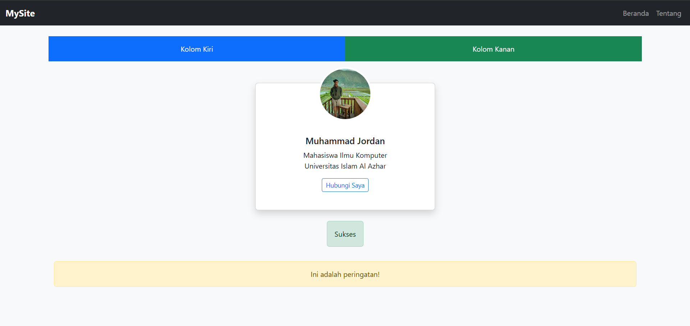

🔰 Apa Itu Bootstrap?
Bootstrap adalah framework front-end open-source yang membantu developer dalam membuat tampilan website yang modern dan responsif dengan lebih cepat dan efisien.

Bootstrap menyediakan:

Komponen siap pakai (navbar, tombol, card, dll)

Grid system berbasis Flexbox

Utilitas CSS yang efisien

Responsivitas yang otomatis tanpa banyak media query manual

⚙️ Cara Menggunakan Bootstrap
1. Menggunakan CDN (Tanpa Instalasi)
    ```<head>
  <link href="https://cdn.jsdelivr.net/npm/bootstrap@5.3.3/dist/css/bootstrap.min.css" rel="stylesheet">
</head>
    ```
2. Menggunakan NPM / Install Lokal
  npm install bootstrap
  Lalu import ke dalam file JS/SCSS Anda:
  
   import 'bootstrap/dist/css/bootstrap.min.css';
  
🧱 Struktur Grid Bootstrap
Bootstrap menggunakan sistem grid berbasis 12 kolom, dan dibagi ke dalam:

Container

Row

Column

🔍 Contoh Grid Responsive
``
<div class="container">
  <div class="row">
    <div class="col-md-6 bg-primary text-white p-3">Kolom Kiri</div>
    <div class="col-md-6 bg-success text-white p-3">Kolom Kanan</div>
  </div>
</div>
```
🧩 Komponen Bootstrap
1. Navbar
   ```<nav class="navbar navbar-expand-lg navbar-dark bg-dark">
  <div class="container-fluid">
    <a class="navbar-brand" href="#">MySite</a>
    <button class="navbar-toggler" data-bs-toggle="collapse" data-bs-target="#nav">
      <span class="navbar-toggler-icon"></span>
    </button>
    <div class="collapse navbar-collapse" id="nav">
      <ul class="navbar-nav ms-auto">
        <li class="nav-item"><a class="nav-link" href="#">Beranda</a></li>
        <li class="nav-item"><a class="nav-link" href="#">Tentang</a></li>
      </ul>
    </div>
  </div>
</nav>
```
2. Card
```<div class="card" style="width: 18rem;">
  
  <div class="card-body">
    <h5 class="card-title">Judul</h5>
    <p class="card-text">Deskripsi singkat konten di dalam card.</p>
    <a href="#" class="btn btn-primary">Baca Selengkapnya</a>
  </div>
</div>
``` 
3. Button dan Alerts
```<button class="btn btn-success">Sukses</button>
<div class="alert alert-warning mt-3">Ini adalah peringatan!</div>
```
🧪 Contoh Mini Project: Halaman Profil Sederhana
```<div class="container text-center my-5">
  <h1 class="mb-4">Profil Mahasiswa</h1>
  <div class="row justify-content-center">
    <div class="col-md-4">
      <div class="card shadow">
        
        <div class="card-body">
          <h5 class="card-title">Muhammad Jordan</h5>
          <p class="card-text">Mahasiswa Ilmu Komputer | Universitas XYZ</p>
          <a href="#" class="btn btn-outline-primary">Hubungi Saya</a>
        </div>
      </div>
    </div>
  </div>
</div>
```


💡 Kelebihan Bootstrap
Kelebihan                    Penjelasan
🚀 Cepat & Mudah             Tak perlu styling dari nol
🔁 Responsif                 Secara otomatis menyesuaikan ukuran layar
🧩 Komponen                  Siap Pakai	Navbar, modal, form, dll
🎨 Konsistensi               Desain	Meminimalkan ketidaksesuaian UI

🚧 Kekurangan Bootstrap
1. Tampilan website bisa terlihat “mirip” dengan website lain jika tidak dikustomisasi
2. Ukuran file bisa besar jika tidak menggunakan versi kustom

✅ Kesimpulan
Boostrap adalah pilihan cerdas untuk membuat sebuah Website yang rapi,cepat namun tetap responsif. Dengan berba komponen siap pakai, framework ini sangat cocok untuk pemula maupun profesional. 

